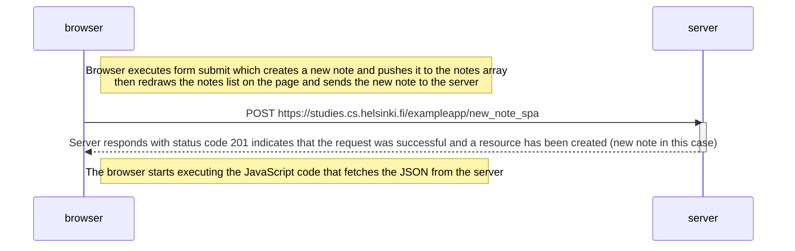

```mermaid
sequenceDiagram
	participant browser
	participant server

	Note right of browser: Browser executes form submit which creates a new note and pushes it to the notes array <br/> then redraws the notes list on the page and sends the new note to the server

	browser->>server: POST https://studies.cs.helsinki.fi/exampleapp/new_note_spa
	activate server
	server-->>browser: Server responds with status code 201 indicates that the request was successful and a resource has been created (new note in this case)
	deactivate server
	
	Note right of browser: The browser starts executing the JavaScript code that fetches the JSON from the server

```